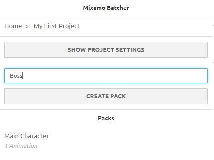

# Introduction

**Mixamo Batcher allows you to create and save animation packs, and download them as an archive file.**

Mixamo is an excellent tool that makes it quick and easy to use 3D motion capture data. However, the standard Mixamo user interface is rather minimal, and over time some built in features have been removed. Mixamo Batcher extends the standard Mixamo UI by inserting some additional features while viewing the site.

Among the features, some included are:

- Project management
- Project wide preferences e.g. download all files as fbx for Unity
- Animation packs that will load the correct character model
- Quickly scaffold out character animation packs by duplicating packs
- Tweaking parameters in Mixamo automatically syncs to pack animations
- Download the entire pack as a single archive file
- Per animation download preferences

This activity will be saved into your browser's local storage, with the ability to export and import project data as JSON.

# Usage

The first thing you will be met with when loading the extension is a home screen with some controls and a list of your projects.

From this screen, you can `Import/Export` projects, create a new project, or view an existing project.

## Creating a project

A project is the way to group together multiple character animation packs.

Entering a project name into the input and clicking "Create Project" will create and save the project.

_After a project is created, it will be automatically loaded._

## Altering project settings

Once you have created a project, you can change its settings:

- You can change the name of the project.
- Changing download settings will apply to all packs and animations in the project. However, they can be overriden on a per-animation basis, see following sections.
- You can delete the project

## Creating a pack

A pack is a set of animations belonging to a specific character. When you create a pack, it will use the current character being previewed in Mixamo.

Viewing a pack after it has been created will trigger that character to be loaded again.

New packs will come with a single animation, a `T-Pose` with project settings overridden to come `With Skin`.

_After a pack is created, it will be automatically loaded._

## Altering pack settings

Once you have created a project, you can change its settings:

- You can change the name of the pack.
- You can change the character the pack uses.
- You can duplicate the pack with a different name.
- You can delete the pack.

## Adding an animation to a pack

Once you have selected an animation to preview in Mixamo (in this example the "Throw" animation), you are able to add it to your pack.

## Syncing animation parameters

When previewing an animation in Mixamo, changing any animation parameters will cause those parameters to be synced back to the currently selected pack and saved, if the animation exists in that pack.

If you then later click on the animation in Mixamo Batcher, it will be loaded with those parameters.

# Technical Details

The primary functionality of this extension is achieved by [hooking into browser XHR](https://github.com/farism/mixamo-batcher/blob/main/src/xhr.ts) and taking additional steps based on which data is being fetched, for example:

- If a new character is uploaded we can fetch some additional data once the upload has completed.
- If we are selecting an animation from a pack, we can override the response coming back from Mixamo API to set some initial animation parameters, e.g. `Character Arm-Space`. This enables us to "save" parameters per animation.

Some basic chrome extension functionality is also used, e.g. updating the tab when an animation has been clicked, which will cause Mixamo to filter down the product list.

## Limitations

- Must be logged into Mixamo.com
- Data is saved in browser localStorage. Uninstalling the extension or clearing extension data will result in data loss. There is an import/export feature to get around this. Depending on popularity a remote data solution could be provided.
- Application functionality is highly dependent on the structure of Mixamo. If the website or APIs change drastically, the extension will most likely break in some way.
- Selecting an animation from a pack may load up more than one page of animations. If the target animation is not on the first page it won't be selected.
- [Max zip size of 2gb](https://chromium.googlesource.com/chromium/src/+/HEAD/storage/browser/blob/README.md#blob-storage-limits)

# License

MIT, see LICENSE file
